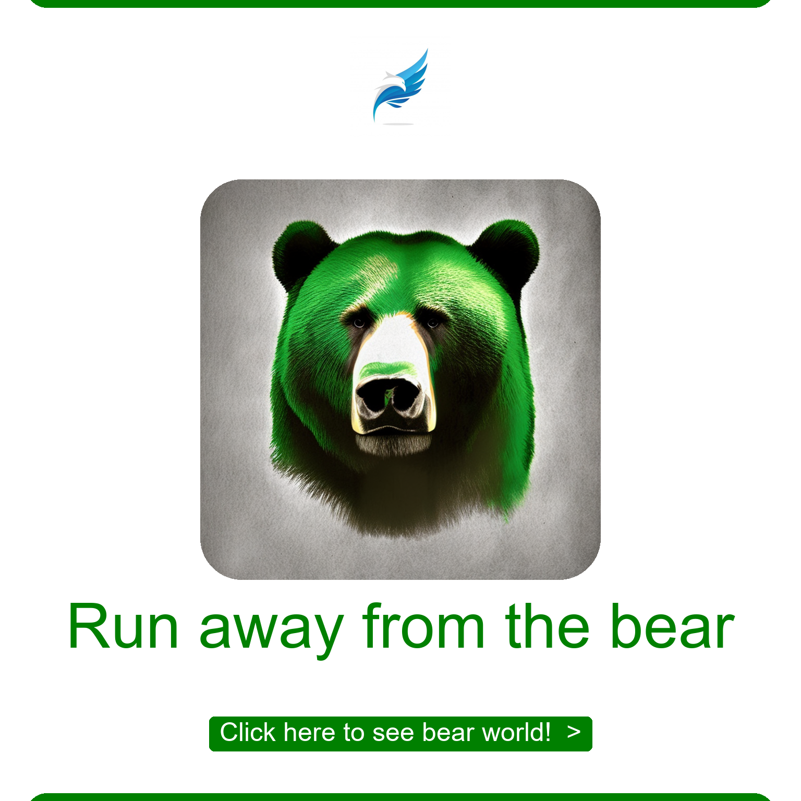

# image-generator
A web-based image generator using Stable Diffusion and Flask.

# Image Generator with Diffusion Model

This project is a web-based application that allows users to generate custom images using a diffusion model. Users can upload images and logos, provide prompts, and customize the output with various text and color settings.

## Features

- **Image Upload**: Users can upload an image and a logo to generate a custom output.
- **Prompt-Based Generation**: The application uses a prompt provided by the user to generate or modify images.
- **Customization**: Users can set the punchline text, button text, and customize colors using hex codes.
- **Diffusion Model**: Utilizes the Stable Diffusion model from Stability AI to generate images.
- **Flask Backend**: The application is built using Flask, handling the image generation and serving the web interface.

## How It Works

### Input

1. **Image**: The main image that will be used or modified based on the prompt.
2. **Logo**: A logo to overlay on the generated image.
3. **Prompt**: A text input that describes the modifications or generation guidance for the diffusion model.
4. **Hex Color Image**: A color code used to modify specific areas of the image.
5. **Punchline**: Text that will be displayed on the generated image.
6. **Button Text**: Text for the button that appears below the punchline.
7. **Hex Color Punchline Button**: A color code used for the punchline button.

### Output

- The application generates a customized image based on the provided inputs, overlaying the logo, modifying the image as per the prompt, and adding the punchline and button text.

### Example Workflow

1. The user uploads an image and a logo.
2. Enters a prompt to guide the image generation.
3. Selects colors for the image and button.
4. Adds a punchline and button text.
5. Clicks "Generate" to produce the customized image.

## Input and Output Examples

Below are example inputs and their corresponding outputs generated by the application.

### Example 1

**Input:**
- **Image:**  <!-- Replace with your actual image path -->
- **Logo:**  <!-- Replace with your actual logo path -->
- **Prompt:** "make the glass bigger"
- **Hex Color Image:** #800080
- **Punchline:** "Best Coffee Shop"
- **Button Text:** "Click here!"
- **Hex Color Punchline Button:** #800080

**Output:**
 <!-- Replace with your actual output image path -->

### Example 2

**Input:**
- **Image:**  <!-- Replace with your actual image path -->
- **Logo:**  <!-- Replace with your actual logo path -->
- **Prompt:** "harden the bear's gaze"
- **Hex Color Image:** #008000
- **Punchline:** "Run away from the bear"
- **Button Text:** "Click here to see bear world!"
- **Hex Color Punchline Button:** #008000

**Output:**
 <!-- Replace with your actual output image path -->

### Example 3

**Input:**
- **Image:**  <!-- Replace with your actual image path -->
- **Logo:**  <!-- Replace with your actual logo path -->
- **Prompt:** "make the image sensational"
- **Hex Color Image:** #008000
- **Punchline:** "THROUGH THE ART"
- **Button Text:** "Click!"
- **Hex Color Punchline Button:** #40E0D0

**Output:**
 <!-- Replace with your actual output image path -->

## Installation

1. Clone the repository:
    ```bash
    git clone https://github.com/yourusername/your-repo-name.git
    cd your-repo-name
    ```

2. Create a virtual environment and activate it:
    ```bash
    python -m venv venv
    source venv/bin/activate  # On Windows use `venv\Scripts\activate`
    ```

3. Install the required dependencies:
    ```bash
    pip install -r requirements.txt
    ```

4. Download the Stable Diffusion model:
    ```python
    # The required model is downloaded in the backend script automatically
    ```

## Usage

1. Run the Flask application:
    ```bash
    python case_api.py
    ```

2. Open your web browser and go to `http://localhost:80` to access the application.

3. Upload an image and a logo, enter the prompt and other details, and click on "Generate" to create your custom image.

## Contributing

Contributions are welcome! Please fork the repository and create a pull request with your changes. Ensure your changes are well-tested and documented.

## License

This project is licensed under the MIT License - see the [LICENSE](LICENSE) file for details.

## Contact

For any questions or feedback, please contact [your-email@example.com].

